# Diagrama ER — Sistema de Gestão para Restaurante/Bar

Este diagrama cobre todas as entidades descritas na Seção 4 do prompt mestre. Para
legibilidade, cada entidade mostra apenas PK/FK e os campos mais relevantes ao
relacionamento — a lista completa de colunas é a fonte de verdade das migrations
em `supabase/migrations/`.

```mermaid
erDiagram
  EMPRESAS ||--o{ USUARIOS : emprega
  EMPRESAS ||--o{ AUDITORIA : gera
  EMPRESAS ||--o{ CATEGORIAS : possui
  EMPRESAS ||--o{ PRODUTOS : possui
  EMPRESAS ||--o{ INSUMOS : possui
  EMPRESAS ||--o{ MESAS : possui
  EMPRESAS ||--o{ COMANDAS : possui
  EMPRESAS ||--o{ CLIENTES : possui
  EMPRESAS ||--o{ CAIXA_SESSOES : possui
  EMPRESAS ||--o{ FORMAS_PAGAMENTO : configura
  EMPRESAS ||--o{ CONTAS : possui
  EMPRESAS ||--o{ ESTOQUE_MOVIMENTOS : registra

  PAPEIS_PERMISSOES }o--|| USUARIOS : "define acesso de"

  CATEGORIAS ||--o{ PRODUTOS : agrupa
  PRODUTOS ||--o{ PRODUTO_VARIACOES : tem
  PRODUTOS ||--o{ PRODUTO_ADICIONAIS : tem
  PRODUTOS ||--o{ FICHA_TECNICA : consome
  INSUMOS ||--o{ FICHA_TECNICA : usado_em
  INSUMOS ||--o{ ESTOQUE_MOVIMENTOS : movimenta
  PRODUTOS ||--o{ COMANDA_ITENS : vendido_como
  PRODUTO_ADICIONAIS ||--o{ COMANDA_ITEM_ADICIONAIS : escolhido_como

  MESAS ||--o{ COMANDAS : recebe
  CLIENTES ||--o{ COMANDAS : faz
  USUARIOS ||--o{ COMANDAS : abre
  COMANDAS ||--o{ COMANDA_ITENS : contem
  COMANDA_ITENS ||--o{ COMANDA_ITEM_ADICIONAIS : recebe
  USUARIOS ||--o{ COMANDA_ITENS : lanca
  COMANDAS ||--o{ COMANDA_TRANSFERENCIAS : origem
  COMANDAS ||--o{ COMANDA_TRANSFERENCIAS : destino
  USUARIOS ||--o{ COMANDA_TRANSFERENCIAS : autoriza

  COMANDAS ||--o{ PAGAMENTOS : quita
  CAIXA_SESSOES ||--o{ PAGAMENTOS : registra
  CAIXA_SESSOES ||--o{ CAIXA_MOVIMENTOS : contem
  COMANDAS ||--o{ CAIXA_MOVIMENTOS : origina
  USUARIOS ||--o{ CAIXA_SESSOES : abre_fecha
  USUARIOS ||--o{ CAIXA_MOVIMENTOS : lanca
  FORMAS_PAGAMENTO ||--o{ PAGAMENTOS : classifica

  COMANDAS ||--o| NOTAS_FISCAIS : emite

  EMPRESAS {
    uuid id PK
    text nome
    text cnpj
    text timezone
    jsonb config
  }
  USUARIOS {
    uuid id PK "= auth.users.id"
    uuid empresa_id FK
    text nome
    enum papel
    text pin_hash
    bool ativo
  }
  PAPEIS_PERMISSOES {
    enum papel PK
    text permissao PK
  }
  AUDITORIA {
    uuid id PK
    uuid empresa_id FK
    uuid usuario_id FK
    text entidade
    uuid entidade_id
    text acao
    jsonb dados_antes
    jsonb dados_depois
    timestamptz created_at
  }

  CATEGORIAS {
    uuid id PK
    uuid empresa_id FK
    text nome
    int ordem
    bool ativo
  }
  PRODUTOS {
    uuid id PK
    uuid empresa_id FK
    uuid categoria_id FK
    text nome
    int preco_centavos
    text codigo_pdv
    bool controla_estoque
    text ncm
    text cfop
    text cst
  }
  PRODUTO_VARIACOES {
    uuid id PK
    uuid produto_id FK
    text nome
    int preco_delta_centavos
  }
  PRODUTO_ADICIONAIS {
    uuid id PK
    uuid produto_id FK
    text nome
    int preco_centavos
    int max_qtd
  }
  INSUMOS {
    uuid id PK
    uuid empresa_id FK
    text nome
    text unidade
    numeric estoque_atual
    numeric estoque_minimo
    int custo_medio_centavos
  }
  FICHA_TECNICA {
    uuid produto_id PK,FK
    uuid insumo_id PK,FK
    numeric quantidade
  }
  ESTOQUE_MOVIMENTOS {
    uuid id PK
    uuid empresa_id FK
    uuid insumo_id FK
    text tipo
    numeric quantidade
    int custo_centavos
    text origem
    uuid origem_id
    uuid usuario_id FK
  }

  MESAS {
    uuid id PK
    uuid empresa_id FK
    int numero
    int capacidade
    text area
    text status
    text qr_token
  }
  CLIENTES {
    uuid id PK
    uuid empresa_id FK
    text nome
    text telefone
    text cpf
  }
  COMANDAS {
    uuid id PK
    uuid empresa_id FK
    text codigo
    uuid mesa_id FK
    text tipo
    text status
    uuid cliente_id FK
    uuid usuario_abertura FK
    numeric taxa_servico_pct
    uuid client_uuid UK
  }
  COMANDA_ITENS {
    uuid id PK
    uuid comanda_id FK
    uuid produto_id FK
    numeric quantidade
    int preco_unit_centavos
    int desconto_centavos
    text status
    uuid usuario_id FK
    uuid client_uuid UK
  }
  COMANDA_ITEM_ADICIONAIS {
    uuid item_id PK,FK
    uuid adicional_id PK,FK
    numeric quantidade
    int preco_centavos
  }
  COMANDA_TRANSFERENCIAS {
    uuid id PK
    uuid origem_id FK
    uuid destino_id FK
    jsonb itens
    uuid usuario_id FK
    text motivo
  }

  CAIXA_SESSOES {
    uuid id PK
    uuid empresa_id FK
    text terminal
    uuid usuario_abertura FK
    int saldo_inicial_centavos
    uuid usuario_fechamento FK
    int saldo_informado_centavos
    int saldo_calculado_centavos
    int diferenca_centavos
    text status
  }
  CAIXA_MOVIMENTOS {
    uuid id PK
    uuid sessao_id FK
    text tipo
    int valor_centavos
    text forma_pagamento
    uuid comanda_id FK
    uuid usuario_id FK
    text motivo
    uuid client_uuid UK
  }
  FORMAS_PAGAMENTO {
    uuid id PK
    uuid empresa_id FK
    text nome
    text tipo
    numeric taxa_pct
    int prazo_dias
  }
  PAGAMENTOS {
    uuid id PK
    uuid comanda_id FK
    uuid sessao_id FK
    text forma
    int valor_centavos
    text bandeira
    int troco_centavos
    int taxa_centavos
  }

  NOTAS_FISCAIS {
    uuid id PK
    uuid comanda_id FK
    text modelo
    text numero
    text chave
    text status
    text protocolo
  }
  CONTAS {
    uuid id PK
    uuid empresa_id FK
    text tipo
    text descricao
    text categoria
    int valor_centavos
    date vencimento
    timestamptz pago_em
  }
```

## Decisões de modelagem

- **`empresa_id` em toda tabela de topo** — mesmo tabelas dependentes de uma FK
  já escopada (ex.: `comanda_itens` via `comanda_id`) preservam o padrão de
  RLS por `empresa_id` nas tabelas-raiz (`comandas`, `mesas`, `produtos` etc.);
  tabelas puramente filhas (`comanda_itens`, `ficha_tecnica`,
  `comanda_item_adicionais`) herdam o isolamento através do JOIN com a tabela
  pai nas policies, evitando coluna redundante onde a FK já garante o escopo.
- **`client_uuid` único** em toda tabela alimentada pelo fluxo offline
  (`comandas`, `comanda_itens`, `caixa_movimentos`) — é a chave de
  idempotência da fila de sincronização (Seção 9).
- **Saldo do caixa nunca é campo mutável direto**: `caixa_sessoes` guarda o
  resultado do fechamento (`saldo_calculado_centavos`,
  `saldo_informado_centavos`, `diferenca_centavos`), mas o valor "esperado"
  é sempre recalculado a partir de `caixa_movimentos` por
  `fn_fechar_caixa()` — nunca escrito diretamente pelo cliente.
- **`papeis_permissoes` é tabela de configuração do sistema**, não dado de
  exemplo — é semeada na migration de Fase 0 (Seção 14 veda apenas seed de
  dados de demonstração como produtos/clientes fictícios).
