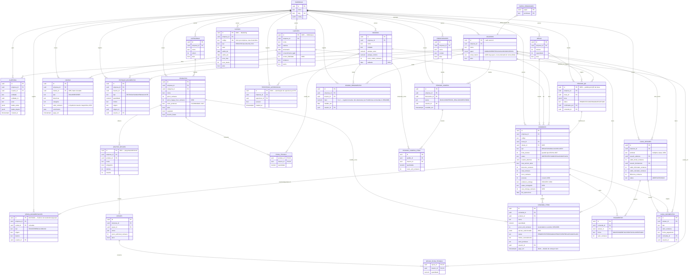

# Diagrama ER — Vision Food (schema `restaurante`)

Reflete o schema real em produção (`supabase/migrations/0021` em diante —
a versão em `public`, migrations `0002`-`0009`, foi substituída pelo
schema `restaurante` na `0021` e não é mais usada). Mostra apenas PK/FK e
os campos mais relevantes ao relacionamento — a lista completa de
colunas é a fonte de verdade das migrations em `supabase/migrations/`.

```mermaid
erDiagram
  EMPRESAS ||--o{ USUARIOS : emprega
  EMPRESAS ||--o{ AUDITORIA : gera
  EMPRESAS ||--o{ CATEGORIAS : possui
  EMPRESAS ||--o{ PRODUTOS : possui
  EMPRESAS ||--o{ INSUMOS : possui
  EMPRESAS ||--o{ MESAS : possui
  EMPRESAS ||--o{ COMANDAS : possui
  EMPRESAS ||--o{ CLIENTES : possui
  EMPRESAS ||--o{ CAIXA_SESSOES : possui
  EMPRESAS ||--o{ CONTAS : possui
  EMPRESAS ||--o{ ESTOQUE_MOVIMENTOS : registra
  EMPRESAS ||--o{ FORNECEDORES : possui
  EMPRESAS ||--o{ PEDIDOS_COMPRA : possui
  EMPRESAS ||--o{ TENTATIVAS_AUTORIZACAO : registra
  EMPRESAS ||--o{ PEDIDOS_QR : recebe
  EMPRESAS ||--o{ VENDA_MOVIMENTACOES : registra
  EMPRESAS ||--o{ INSUMO_RENDIMENTOS : registra
  EMPRESAS ||--o{ CUPONS : possui

  PAPEIS_PERMISSOES }o--|| USUARIOS : "define acesso de"

  CATEGORIAS ||--o{ PRODUTOS : agrupa
  PRODUTOS ||--o{ FICHA_TECNICA : consome
  PRODUTOS ||--o{ GRUPOS_OPCOES : oferece
  GRUPOS_OPCOES ||--o{ OPCOES : contem
  OPCOES ||--o{ OPCAO_FICHA_TECNICA : consome
  INSUMOS ||--o{ FICHA_TECNICA : usado_em
  INSUMOS ||--o{ OPCAO_FICHA_TECNICA : usado_em
  INSUMOS ||--o{ ESTOQUE_MOVIMENTOS : movimenta
  INSUMOS ||--o{ INSUMO_RENDIMENTOS : mede
  INSUMOS ||--o{ PEDIDOS_COMPRA_ITENS : comprado_como
  PRODUTOS ||--o{ COMANDA_ITENS : vendido_como

  FORNECEDORES ||--o{ PEDIDOS_COMPRA : recebe
  PEDIDOS_COMPRA ||--o{ PEDIDOS_COMPRA_ITENS : contem

  MESAS ||--o{ COMANDAS : recebe
  MESAS ||--o{ PEDIDOS_QR : origina
  CLIENTES ||--o{ COMANDAS : faz
  CLIENTES ||--o{ CONTAS : deve
  USUARIOS ||--o{ COMANDAS : abre
  COMANDAS ||--o{ COMANDA_ITENS : contem
  COMANDAS ||--o{ VENDA_MOVIMENTACOES : "transferida/juntada em"
  USUARIOS ||--o{ COMANDA_ITENS : lanca
  PEDIDOS_QR ||--o| COMANDAS : "confirma em"
  USUARIOS ||--o{ PEDIDOS_QR : confirma_ou_rejeita

  COMANDAS ||--o{ PAGAMENTOS : quita
  CAIXA_SESSOES ||--o{ PAGAMENTOS : registra
  CAIXA_SESSOES ||--o{ CAIXA_MOVIMENTOS : contem
  COMANDAS ||--o{ CAIXA_MOVIMENTOS : origina
  USUARIOS ||--o{ CAIXA_SESSOES : abre_fecha
  USUARIOS ||--o{ CAIXA_MOVIMENTOS : lanca

  USUARIOS ||--o{ TENTATIVAS_AUTORIZACAO : "autoriza (supervisor)"
  USUARIOS ||--o{ AUDITORIA : realiza
  USUARIOS ||--o{ ESTOQUE_MOVIMENTOS : lanca
  USUARIOS ||--o{ INSUMO_RENDIMENTOS : mede
  USUARIOS ||--o{ PEDIDOS_COMPRA : realiza

  EMPRESAS {
    uuid id PK
    text nome
    text slug UK
    jsonb config
  }
  USUARIOS {
    uuid id PK "= auth.users.id"
    uuid empresa_id FK
    text nome
    enum papel "ADMIN/GERENTE/CAIXA/GARCOM/COZINHA"
    text email_interno "UUID+slug opaco, nunca derivado do nome (0044)"
    bool ativo
  }
  PAPEIS_PERMISSOES {
    enum papel PK
    text permissao PK
  }
  AUDITORIA {
    uuid id PK
    uuid empresa_id FK
    uuid usuario_id FK
    text entidade
    uuid entidade_id
    text acao
    jsonb dados_antes
    jsonb dados_depois
    timestamptz created_at
  }

  CATEGORIAS {
    uuid id PK
    uuid empresa_id FK
    text nome
    int ordem
    bool ativo
  }
  PRODUTOS {
    uuid id PK
    uuid empresa_id FK
    uuid categoria_id FK
    text nome
    int preco_centavos
    int preco_happy_hour_centavos "0056"
    text setor_producao "COZINHA/BAR, 0027"
    bool ativo
    bool esgotado
    bool favorito_fixado
  }
  GRUPOS_OPCOES {
    uuid id PK "0051 — perguntas/adicionais"
    uuid empresa_id FK
    uuid produto_id FK
    text nome
    bool obrigatorio
    int minimo
    int maximo
  }
  OPCOES {
    uuid id PK
    uuid empresa_id FK
    uuid grupo_id FK
    text nome
    int preco_adicional_centavos
    bool ativo
  }
  OPCAO_FICHA_TECNICA {
    uuid opcao_id PK,FK
    uuid insumo_id PK,FK
    numeric quantidade
  }
  INSUMOS {
    uuid id PK
    uuid empresa_id FK
    text nome
    text unidade
    numeric estoque_atual
    numeric estoque_minimo
    int custo_medio_centavos
    date validade "0054"
  }
  FICHA_TECNICA {
    uuid produto_id PK,FK
    uuid insumo_id PK,FK
    numeric quantidade
  }
  INSUMO_RENDIMENTOS {
    uuid id PK
    uuid empresa_id FK
    uuid insumo_id FK
    numeric fator "0 a 1 — registro/consulta, não afeta baixa (ver Pendências conhecidas no README)"
    date medido_em
    uuid usuario_id FK
  }
  ESTOQUE_MOVIMENTOS {
    uuid id PK
    uuid empresa_id FK
    uuid insumo_id FK
    text tipo "ENTRADA/SAIDA/VENDA/AJUSTE"
    numeric quantidade
    text motivo
    text origem
    uuid origem_id
    uuid usuario_id FK
  }
  FORNECEDORES {
    uuid id PK
    uuid empresa_id FK
    text nome
    text contato
    bool ativo
  }
  PEDIDOS_COMPRA {
    uuid id PK
    uuid empresa_id FK
    uuid fornecedor_id FK
    text status "RASCUNHO/PEDIDO_REALIZADO/RECEBIDO"
    uuid usuario_id FK
    timestamptz recebido_em
  }
  PEDIDOS_COMPRA_ITENS {
    uuid id PK
    uuid pedido_id FK
    uuid insumo_id FK
    numeric quantidade
    int custo_unit_centavos
  }

  MESAS {
    uuid id PK
    uuid empresa_id FK
    int numero
    int capacidade
    text area
  }
  CLIENTES {
    uuid id PK "0055 — CRM básico"
    uuid empresa_id FK
    text nome
    text telefone
    date aniversario
    bool consentimento_lgpd
    int pontos_fidelidade "0058"
    text endereco
    text bairro
  }
  PEDIDOS_QR {
    uuid id PK "0059 — pedido pelo QR da mesa"
    uuid empresa_id FK
    uuid mesa_id FK
    jsonb itens
    text status "PENDENTE/CONFIRMADO/REJEITADO"
    uuid confirmado_por FK
    uuid comanda_id FK
  }
  COMANDAS {
    uuid id PK
    uuid empresa_id FK
    text codigo
    uuid mesa_id FK
    uuid cliente_id FK "0055"
    text tipo "MESA/FICHA/BALCAO/DELIVERY"
    int ficha_numero "quando tipo=FICHA, 0027"
    text status "ABERTA/FECHANDO/PAGA/CANCELADA"
    uuid usuario_abertura FK
    bool taxa_servico_ativa
    int desconto_centavos
    int total_centavos
    int troco_centavos
    int pessoas "couvert, 0056"
    text endereco_entrega "DELIVERY, 0058"
    text status_entregador "0058"
    int taxa_entrega_centavos "0058"
    date dia_operacional
  }
  COMANDA_ITENS {
    uuid id PK
    uuid comanda_id FK
    uuid produto_id FK
    text nome
    numeric quantidade
    int preco_unit_centavos "recalculado no servidor, 0051/0056"
    jsonb opcoes_selecionadas "0051"
    text status "PENDENTE/PREPARANDO/PRONTO/ENTREGUE/CANCELADO"
    text motivo_cancelamento
    text setor_producao
    uuid usuario_id FK
    timestamptz pago_em "0049 — divisão de conta por item"
  }
  VENDA_MOVIMENTACOES {
    uuid id PK "0027/0048 — histórico de transferência/junção"
    uuid empresa_id FK
    uuid venda_id FK "comanda"
    text tipo "TRANSFERENCIA/JUNCAO"
    text origem
    text destino
    uuid usuario_id FK
  }
  CUPONS {
    uuid id PK "0062 — Marketing"
    uuid empresa_id FK
    text codigo UK "único por empresa, case-insensitive"
    text tipo "PERCENTUAL/VALOR_FIXO"
    int valor
    date valido_de
    date valido_ate
    int usos_max
    int usos_atuais
    bool ativo
  }
  TENTATIVAS_AUTORIZACAO {
    uuid id PK "0043 — autorização de supervisor por PIN"
    uuid empresa_id FK
    uuid supervisor_id FK
    bool sucesso
    timestamptz created_at
  }

  CAIXA_SESSOES {
    uuid id PK
    uuid empresa_id FK
    text terminal "múltiplos caixas, 0050"
    uuid usuario_abertura FK
    int saldo_inicial_centavos
    uuid usuario_fechamento FK
    int saldo_informado_centavos
    int saldo_calculado_centavos
    int diferenca_centavos
    text status "ABERTA/FECHADA"
  }
  CAIXA_MOVIMENTOS {
    uuid id PK
    uuid sessao_id FK
    text tipo
    int valor_centavos
    text forma_pagamento
    uuid comanda_id FK
    uuid usuario_id FK
  }
  PAGAMENTOS {
    uuid id PK
    uuid comanda_id FK
    uuid sessao_id FK
    text forma "DINHEIRO/DEBITO/CREDITO/VOUCHER/FIADO"
    int valor_centavos
  }
  CONTAS {
    uuid id PK
    uuid empresa_id FK
    uuid cliente_id FK "0055, fiado vinculado"
    text tipo "PAGAR/RECEBER"
    text descricao
    text categoria
    int valor_centavos "já líquido de taxa de maquininha, 0053"
    date vencimento
    timestamptz pago_em
  }
```

## Decisões de modelagem

- **`empresa_id` em toda tabela de topo** — mesmo tabelas dependentes de uma FK
  já escopada (ex.: `comanda_itens` via `comanda_id`) preservam o padrão de
  RLS por `empresa_id` nas tabelas-raiz (`comandas`, `mesas`, `produtos` etc.);
  tabelas puramente filhas (`comanda_itens`, `ficha_tecnica`,
  `opcao_ficha_tecnica`, `pedidos_compra_itens`) herdam o isolamento através
  do JOIN com a tabela pai nas policies, evitando coluna redundante onde a
  FK já garante o escopo.
- **`papeis_permissoes` é tabela de configuração do sistema**, não dado de
  exemplo — é semeada na migration de bootstrap e espelhada no client em
  `assets/js/config.js` (`PERM`/`MATRIZ`) só pra UI; a trava de verdade é
  sempre `restaurante.tem_permissao(...)` no servidor.
- **Saldo do caixa nunca é campo mutável direto**: `caixa_sessoes` guarda o
  resultado do fechamento (`saldo_calculado_centavos`,
  `saldo_informado_centavos`, `diferenca_centavos`), mas o valor "esperado"
  é sempre recalculado a partir de `caixa_movimentos` pela RPC de
  fechamento — nunca escrito diretamente pelo cliente.
- **`email_interno` (0044) é um e-mail opaco** (`uuid@slug.internal`),
  nunca derivado do nome do funcionário — é a credencial real de login no
  Supabase Auth (o PIN de 4 dígitos é a senha). Ver o bug corrigido na
  `0060` (`verificar_pin_supervisor` ainda reconstruía esse e-mail a partir
  do nome) como lição de por que nunca reconstruir isso em outro lugar.
- **Preço de item sempre recalculado no servidor** (`trg_comanda_itens_calcula_preco`,
  `0051`/`0056`) a partir de `produtos`/`opcoes`, nunca confiado ao que o
  client manda em `opcoes_selecionadas` — inclusive o preço de happy hour.
- **`pedidos_qr` nunca grava direto em `comanda_itens`** — é uma fila de
  aprovação; só a RPC `confirmar_pedido_qr` (que roda a mesma trava de
  preço/opções) cria os itens de verdade.
- **Cupom, pontos de fidelidade e desconto manual da comanda empilham**
  (somam) no fechamento — nenhum dos três cancela os outros. Os três só
  valem fechando a conta inteira, nunca em pagamento parcial por item
  (mesma trava, pra não ter que decidir "de quem" é o desconto quando a
  conta é dividida). `cupons.codigo` é único por empresa e comparado
  sempre via `upper()` no servidor — nunca confie em maiúsculas/minúsculas
  vindas do client.
